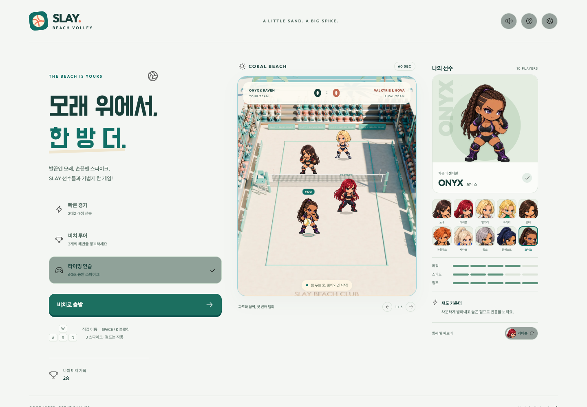

# SLAY Beach Volley

모래 위에서, 한 방 더. 모바일 세로 화면에 맞춘 **2대2 캐주얼 비치발리볼** 게임입니다.

**[바로 플레이하기](https://rockyhong-a11y.github.io/slay-beach-volley/?v=5)**



## 플레이

**이동·스파이크·블로킹은 직접, 토스와 공격 점프는 자동입니다.** 이동은 항상 스틱이나 방향키·WASD로 직접 조작하며, 입력을 놓으면 그 자리에 멈춥니다. 공 근처로 이동하면 자동으로 뛰어 토스하며, 높은 토스를 여유 있게 이어줍니다. 파트너가 올린 공 아래에 있으면 자동으로 공격 점프를 합니다. 스파이크 버튼이 빛날 때 눌러 공격하세요. 길게 눌렀다 놓으면 더 강하게 치고, 공이 손 높이에 내려오는 순간 맞추면 `PERFECT!` 판정이 납니다. 네트 앞에서는 별도 블로킹 버튼으로 상대 공격을 막습니다.

혼자 플레이하며, 동료와 상대 선수들은 AI가 조작합니다.

| 동작 | 모바일 | 키보드 |
| --- | --- | --- |
| 이동 | 왼쪽 스틱 | WASD / 방향키 |
| 토스 / 공격 점프 | 공 근처로 이동하면 자동 | 자동 |
| 스파이크 | 스파이크 버튼 | J |
| 블로킹 | 블로킹 버튼 | Space / K |
| 강타 | 스파이크를 누른 채 충전한 뒤 놓기 | J를 누른 채 충전한 뒤 놓기 |
| 일시정지 | 오른쪽 위 일시정지 | Escape |

- **빠른 경기**: 2대2, 7점 선승. 가볍게 / 보통 / 도전 난이도.
- **비치 투어**: 코랄 비치 → 선셋 코브 → 문라이트 베이의 3연전. 승리하면 다음 해변으로 이동합니다.
- **타이밍 연습**: 60초 동안 스파이크와 퍼펙트 타이밍을 연습합니다.
- 한 팀은 최대 3회 터치할 수 있으며 같은 선수의 연속 터치는 금지됩니다. 상대 코트에 공을 떨어뜨리면 득점. 네트와 아웃은 마지막 타격 팀의 실점입니다.

## 원본 캐릭터 10명

[원본 SLAY](https://rockyhong-a11y.github.io/slay/)의 SD 2D 스프라이트와 정체성을 그대로 사용합니다. 새로 생성하거나 의상·얼굴을 다시 그리지 않았습니다. 원본의 3개 포즈를 프레임으로 사용하고, 이동·체공·타격에 회전과 자세 변화를 더합니다.

**노바, 레이븐, 발키리, 바이퍼, 엠버, 아틀라스, 세라프, 링스, 템페스트, 오닉스.**

배구 능력치(파워·스피드·점프)는 이 게임을 위해 따로 밸런싱했습니다. 선수와 파트너를 바꾸며 조합을 만들 수 있습니다. 원본 1774×887 시트를 모바일용 888×444 WebP와 작은 얼굴 미리보기로 최적화했습니다. 원본 투명도와 프레임 구성을 유지하며, 원본 PNG와 배포 WebP의 SHA-256을 `src/sprites.json`에 기록했습니다.

## 구현

- Blender에서 만든 8×16m 대회 경기장: 입체 관중석, 광고 보드, 모래 질감, 네트·지주·안테나, 실제 광원과 그림자. 낮·노을·야간 조명을 따로 렌더링합니다. 원본 2D 선수를 렌더 카메라와 같은 좌표에 배치하고, 투명 네트 레이어로 앞뒤를 구분합니다. 모바일에서는 최적화된 WebP 배경으로 실행합니다.
- 토스의 상승형 이펙트, 세트의 나선 리본, 스파이크의 방향성 타격 불꽃·충격파·강타 궤적, 블로킹의 육각 방어막·반동 파편. 퍼펙트 타격 정지와 짧은 화면 흔들림, 모래 파티클, 지원 기기의 진동을 함께 사용합니다. 동작 줄이기에서는 궤적과 흔들림을 끄고 짧고 적은 이펙트를 표시합니다.
- 배구 타격·스파이크·휘슬 녹음과 모래 발소리 폴리 사운드를 Web Audio로 재생합니다. 토스·스파이크·블로킹의 소리 크기와 레이어를 구분하며, 출처·라이선스는 [사운드 자료](assets/audio/SOURCES.md)에 기록합니다.
- 공의 3차원 위치를 같은 경기장 카메라로 투영하는 포물선 궤적과 120Hz 고정 간격 물리 연산.
- 터치 포인터 캡처로 이동·블로킹·공격을 동시에 조작. 주소 표시줄 변화와 안전 영역에 대응하는 세로 화면.
- 버튼·캐릭터·코트를 길게 눌러도 텍스트 선택, 네이티브 팝업, 이미지 드래그가 발생하지 않도록 CSS와 이벤트를 처리합니다. 실제 입력 필드와 기본 스크롤·확대·키보드 조작은 사용할 수 있습니다.
- 네이티브 대화상자, 키보드 조작, 점수 안내, 시스템 다크 모드, 동작 줄이기 지원.
- 앱 전환 시 자동 일시정지. 선수·설정·승리·투어 우승·연습 최고 기록을 기기에 저장.
- 서비스 워커가 첫 방문에서 게임과 10명 선수의 리소스를 캐시하여 이후 오프라인에서도 실행할 수 있습니다. 캐시가 완료될 때까지 첫 접속은 온라인 상태로 유지해주세요. 다른 앱의 캐시는 삭제하지 않습니다.
- 서버·로그인·외부 API 없이 실행되며, 런타임 라이브러리 의존성도 없습니다.

## 로컬 실행

Node.js 22 이상이 필요합니다.

```sh
npm ci
npm run dev
```

`http://localhost:5173`에서 플레이할 수 있습니다. 같은 네트워크의 모바일에서는 개발 컴퓨터의 IP와 `:5173`을 사용하세요.

```sh
npm test         # 물리 / 경기 / 원본 자산 검증
npm run build    # dist/ 생성
npm run preview  # 완성된 dist/ 실행
```

브라우저 검증에는 Playwright를 사용합니다. 기본적으로 macOS에 설치된 Chrome을 이용합니다. 다른 환경에서는 `npx playwright install chromium` 후 `npm run test:browser`를 실행하세요. `PLAYWRIGHT_CHROME`으로 브라우저 경로, `GAME_URL`로 검증할 게임 주소를 지정할 수 있습니다.

GitHub Actions는 main 브랜치의 테스트와 빌드를 수행한 뒤 `dist/`를 GitHub Pages에 배포합니다. 앱 내부의 자산 주소가 상대 경로라서 저장소 하위 경로에서도 작동합니다.

## 참고와 출처

- 게임 구성 참고: [U.S. Championship V’ball 영상](https://youtu.be/_ySuGAtNFc0). 2대2, 팀 랠리, 캐주얼한 비치 경기의 방향을 참고했습니다.
- 타격 표현 참고: [배구의 왕 영상](https://youtu.be/hienypKo6hY). 점프 공격과 터치 조작의 방향을 참고했습니다.
- 영상은 제공된 페이지의 제목·설명·공개 미리보기로 확인했습니다. 원본 영상 전체를 재생하거나 효과음을 직접 청취한 검증은 하지 못했습니다.
- 캐릭터: [rockyhong-a11y/slay](https://github.com/rockyhong-a11y/slay), 소스 확인 커밋 `7a1bfbe261862f7c6a44981faf6ae9fb63eddb8c`, MIT.
- UI 아이콘: [Phosphor Icons](https://github.com/phosphor-icons/core), MIT.
- 글꼴: Outfit, Do Hyeon. 자체 호스팅, SIL Open Font License.

자세한 자산 정보는 [ATTRIBUTIONS.md](ATTRIBUTIONS.md)와 `assets/licenses/`, `assets/fonts/*OFL.txt`에 있습니다.

경기장 모델과 렌더링 재현 방법은 [3D 경기장 자료](assets/courts/SOURCES.md), 타격 이펙트 참고 자료는 [이펙트 자료](artifacts/vfx-sources.md)에 있습니다.
